# Pedidos Backend MVC DC
Back-end com duas coleções mockup JSON clientes e pedidos, CRUD, para aprender MVC e UML diagrama de classes
## Diagramas

## Tecnologias
- Node.js
- VsCode (Thunder Client)
- JavaScript
- MVC
## Passos para testar
- Clone esta repositório e abra com VsCode
- Instale as depenências e execute com os seguintes comandos no terminal:
```bash
npm install
npm run dev
```
## Testes
### Listar
- Cliente:
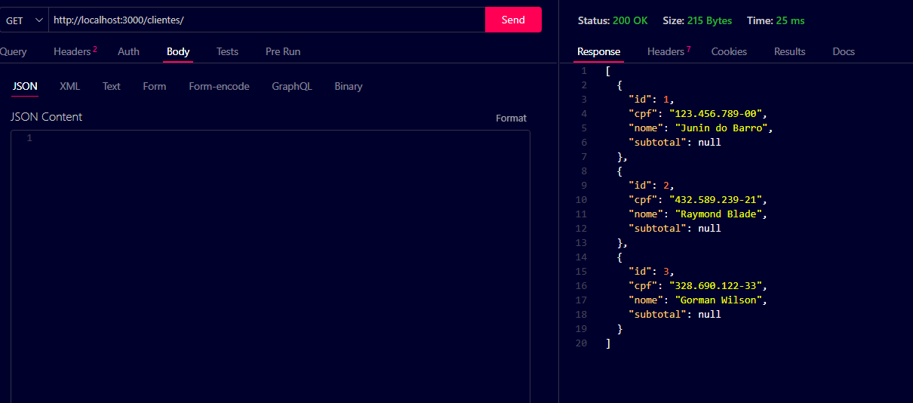
- Pedido:
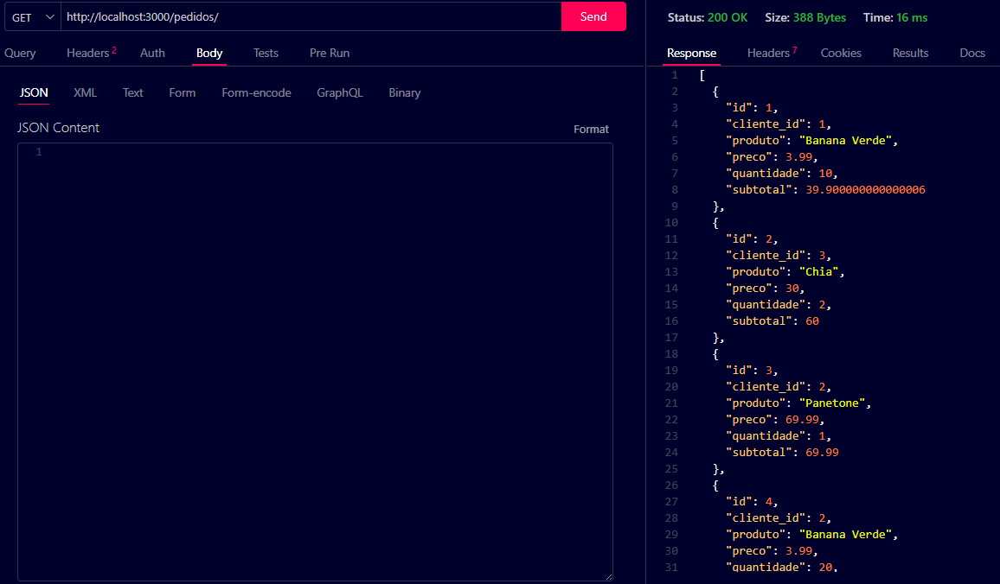
### Deletar
#### Pedido
- Encontrado:
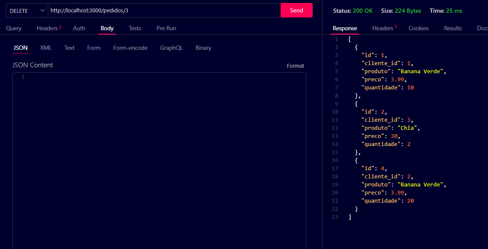
- Não encontrado:
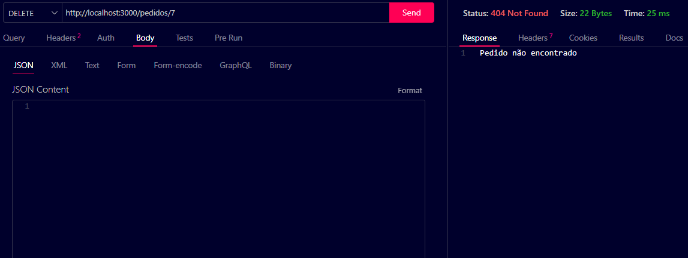
#### Cliente
- Encontrado:
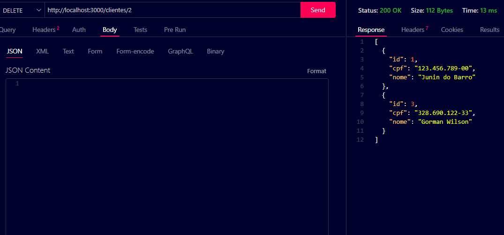
- Não encontrado:
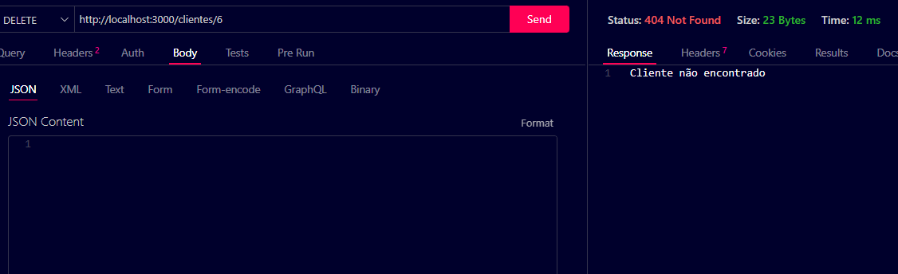
### Criar
- Pedido:
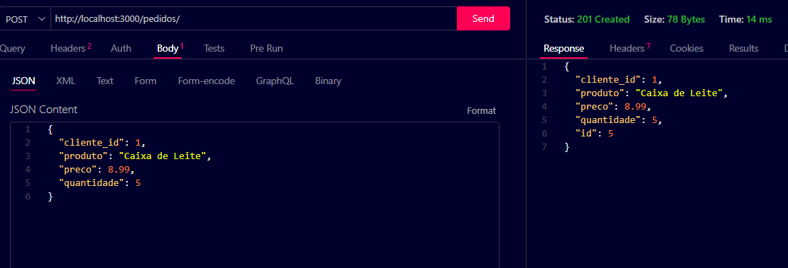
- Cliente:
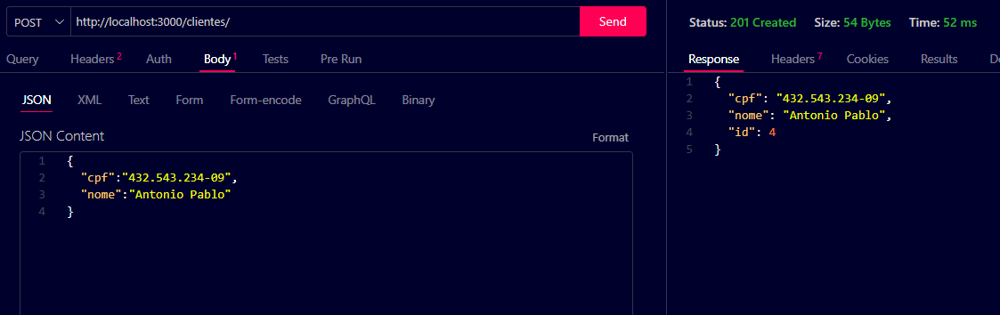
### Alterar
#### Pedido
- Encontrado:
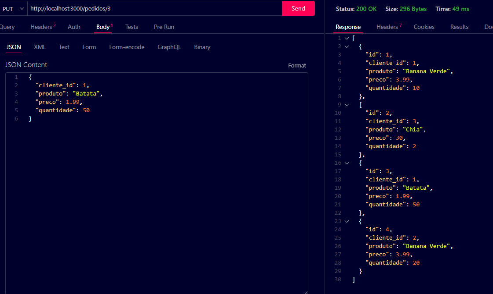
- Não encontrado:
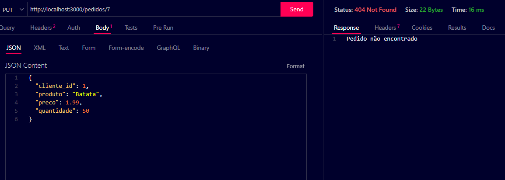
#### Cliente
- Encontrado:
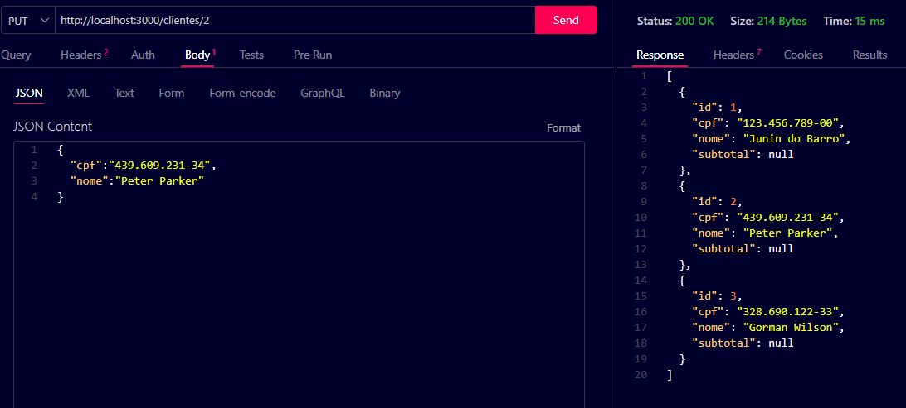
- Não encontrado:
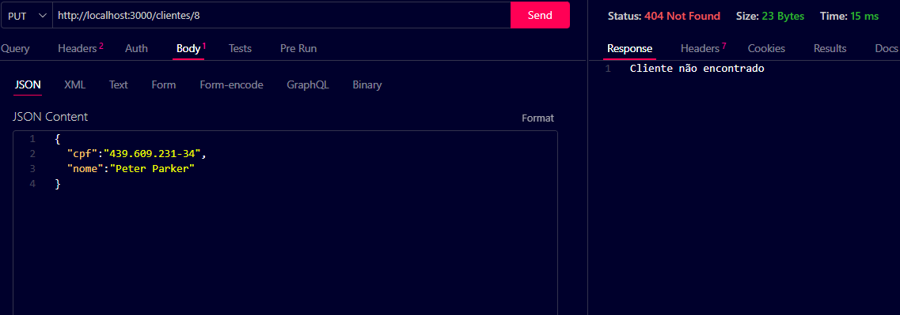


